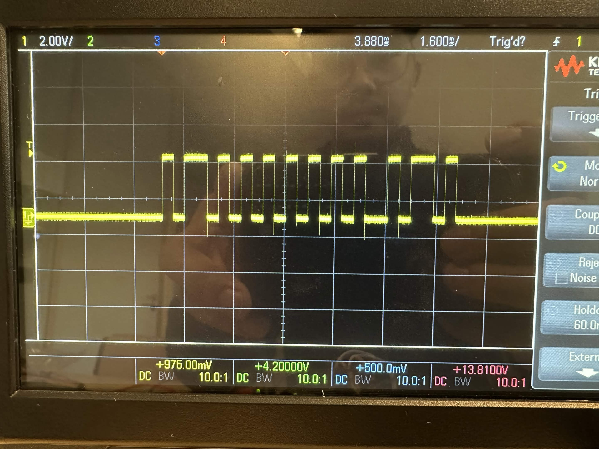
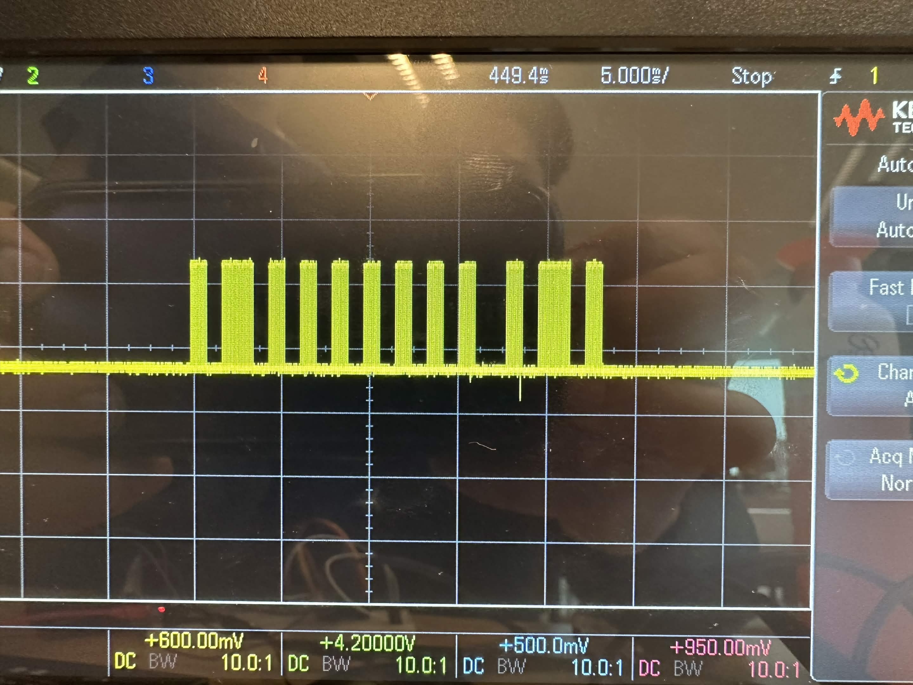
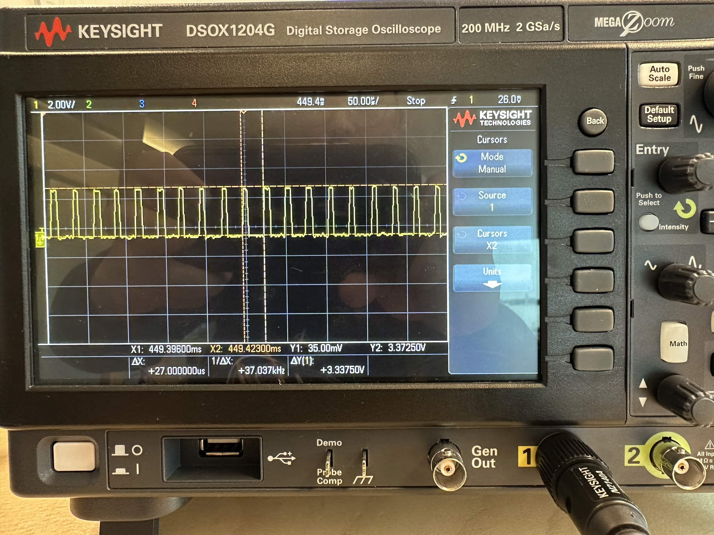

# LaserTag Opdracht 1 – Fase 1: IR Transmitter

**Hogeschool VIVES Brugge** | Game Technology Labo | Maart 2026

---

## Inhoudsopgave

1. [Inleiding](#1-inleiding)
2. [Theoretische Achtergrond](#2-theoretische-achtergrond)
3. [Hardware](#3-hardware)
4. [STM32CubeMX Configuratie](#4-stm32cubemx-configuratie)
5. [Software](#5-software)
6. [Berekeningen](#6-berekeningen)
7. [Testing](#7-testing)
8. [Resultaten](#8-resultaten)
9. [Conclusie](#9-conclusie)
10. [Referenties](#10-referenties)

---

## 1. Inleiding

Dit project ontwikkelt een **IR zender** voor een LaserTag-systeem op de **STM32L432KC Nucleo-32**. Het systeem verstuurt IR-signalen via het **RC5-protocol**, gemoduleerd op een **38 kHz draaggolf**.

**Doelstellingen:**
- RC5 frames verzenden via infrarood
- Stabiele 38 kHz carrier genereren
- Manchester-codering toepassen
- Bereik van minimaal 3 meter

**Belangrijkste specificaties:**

| Parameter | Waarde |
|-----------|--------|
| Microcontroller | STM32L432KC |
| Klokfrequentie | 32 MHz |
| Protocol | RC5 (14-bit) |
| Carrier | 38 kHz, 25% duty |
| IR LED | TSAL6200 (940 nm) |
| LED Stroom | 37 mA |
| Bereik | 3-5 meter |

---

## 2. Theoretische Achtergrond

### 2.1. RC5 Protocol

## 2. Theoretische Achtergrond

### 2.1. RC5 Protocol

Het RC5-protocol (Philips, 1987) is een standaard voor IR-afstandsbediening. Een frame bestaat uit **14 bits**:

| Veld | Bits | Functie |
|------|------|---------|
| Start S1 | Bit 13 | Altijd '1' |
| Field S2 | Bit 12 | '1' voor commando's 0-63 |
| Toggle | Bit 11 | Wisselt bij nieuwe toetsdruk |
| Address | Bits 10-6 | Apparaat ID (0-31) |
| Command | Bits 5-0 | Functie (0-63) |

**Timing:** 1,778 ms per bit → totaal frame duur = 24,9 ms

### 2.2. Manchester Codering

Manchester codering is zelf-kloksync: elke bit bevat een transitie in het midden:
- **Logische '1':** Hoog → Laag (neergaande flank)
- **Logische '0':** Laag → Hoog (opgaande flank)

Voordelen: DC-balans, clock recovery, foutdetectie  
Nadeel: Vereist dubbele bandbreedte (14 bits → 28 Manchester bits)



*Figuur 1: RC5 frame met Manchester-codering*

### 2.3. Infrarood Communicatie en 38 kHz Carrier

**IR LED TSAL6200:** 940 nm golflengte, 50 mW/sr @ 100 mA

**TSOP4838 Receiver:** 38 kHz banddoorlaatfilter, AGC voor omgevingslicht

De **38 kHz draaggolf** is industriestandaard en filtert stoorsignalen. PWM met 25% duty cycle bespaart energie:
- Piekstroom: 37 mA
- Gemiddeld tijdens burst: 9,25 mA
- Totaal gemiddeld: ~4,6 mA

---

## 3. Hardware

### 3.1. Bill of Materials

| Component | Type | Waarde | Functie |
|-----------|------|--------|---------|
| Microcontroller | STM32L432KC | Nucleo-32 | Main controller |
| Transistor | BC547 NPN | h<sub>FE</sub> ≈ 200 | LED driver |
| IR LED | TSAL6200 | 940 nm | IR transmitter |
| R<sub>B</sub> | Weerstand | 1 kΩ | Basisstroom |
| R<sub>C</sub> | Weerstand | 47 Ω | LED stroom limiter |
| IR Receiver | TSOP4838 | 38 kHz | Test (Fase 2) |

### 3.2. Schakeling

```
       +3,3V
         │
       [R2=47Ω]
         │
      IR LED +
         │ -
         C
        ┌┴┐ BC547
PA6 ────┤B│
  (TIM16)└┬┘
       [R1=1kΩ] E
         │ │
        GND GND
```



*Figuur 2: Transistorschakeling op breadboard*

### 3.3. Berekeningen

**LED stroom (Collector):**

I<sub>C</sub> = (V<sub>CC</sub> - V<sub>LED</sub> - V<sub>CE,sat</sub>) / R<sub>C</sub>  
I<sub>C</sub> = (3,3V - 1,35V - 0,2V) / 47Ω = **37 mA** ✓

**Basisstroom:**

Voor verzadiging: I<sub>B</sub> > I<sub>C</sub> / h<sub>FE</sub>  
Veilige keuze: I<sub>B</sub> = 2,6 mA

R<sub>B</sub> = (V<sub>GPIO</sub> - V<sub>BE</sub>) / I<sub>B</sub>  
R<sub>B</sub> = (3,3V - 0,7V) / 0,0026A = 1000Ω → **1 kΩ** ✓

**Vermogen:**
- P(R<sub>C</sub>) = 37mA² × 47Ω = 64 mW (1/4W weerstand OK)
- P(LED) = 37mA × 1,35V = 50 mW

---

## 4. STM32CubeMX Configuratie

STM32CubeMX genereert automatisch initialisatiecode voor de microcontroller.

### 4.1. Clock Setup

**MSI + PLL configuratie naar 32 MHz:**
- MSI: 4 MHz (Range 6)
- PLL: ÷1 × 16 ÷2 = 32 MHz
- SYSCLK: 32 MHz (van PLLCLK)



*Figuur 3: STM32CubeMX clock tree*

### 4.2. Timer 16 - 38 kHz PWM

| Parameter | Waarde |
|-----------|--------|
| PSC | 0 |
| ARR | 842 |
| CCR1 | 210 |
| Pins | PA6 (AF14) |

**Berekening:**  
f = 32MHz / (843) = **37,968 kHz** ≈ 38 kHz ✓  
Duty = 210/843 = **24,9%** ✓

### 4.3. Timer 15 - 889 µs Interrupt

| Parameter | Waarde |
|-----------|--------|
| PSC | 31 (→ 1 MHz) |
| ARR | 888 |
| Interrupt | TIM1_BRK_TIM15_IRQn |
| Priority | 0 (hoogste) |

**Berekening:**  
T = 1µs × 889 = **889 µs** (halve RC5 bitperiode) ✓

### 4.4. Project Generatie

- Toolchain: MDK-ARM V5 (Keil)
- Code style: Peripheral in separate files
- Genereer en open in Keil µVision

---

## 5. Software

### 5.1. Bestandsstructuur

```
Core/
├── Inc/
│   ├── ir_common.h          → Constanten, macros
│   └── rc5_encode.h         → RC5 API
└── Src/
    ├── main.c                → Setup + main loop
    └── rc5_encode.c          → RC5 + Manchester logic
```

### 5.2. Frame Generatie

**RC5 frame samenstellen:**
```c
uint16_t RC5_BinFrameGeneration(uint8_t addr, uint8_t cmd, bool toggle) {
    uint16_t frame = 0x3000;        // Start bits (S1=1, S2=1)
    frame |= (toggle ? 0x800 : 0);  // Toggle bit
    frame |= ((addr & 0x1F) << 6);  // Address (5 bits)
    frame |= (cmd & 0x3F);          // Command (6 bits)
    return frame;
}
```

**Manchester conversie:**
- Elke RC5 bit → 2 Manchester bits
- '1' → '10' (high-low)
- '0' → '01' (low-high)
- 14 bits → 28 Manchester bits

### 5.3. Interrupt Routine

Elke 889 µs:
```c
void HAL_TIM_PeriodElapsedCallback(TIM_HandleTypeDef *htim) {
    if (htim->Instance == TIM15) {
        uint8_t current_bit = manchester_buffer[bit_index];
        
        if (current_bit == 1) {
            CARRIER_ON();   // TIM16 PWM enable
        } else {
            CARRIER_OFF();  // TIM16 PWM disable
        }
        
        bit_index++;
        if (bit_index >= 28) {
            CARRIER_OFF();
            HAL_TIM_Base_Stop_IT(&htim15);
        }
    }
}
```

**Carrier control via registers:**
```c
#define CARRIER_ON()  TIM16->BDTR |= TIM_BDTR_MOE
#define CARRIER_OFF() TIM16->BDTR &= ~TIM_BDTR_MOE
```

---

## 6. Berekeningen

### 6.1. Timer Frequenties

**TIM16 (Carrier):**  
f<sub>PWM</sub> = 32 MHz / (PSC+1) / (ARR+1)  
f<sub>PWM</sub> = 32 MHz / 1 / 843 = **37,968 kHz**

Error = |38000 - 37968| / 38000 × 100% = **0,084%** ✓

**TIM15 (Manchester):**  
T<sub>IRQ</sub> = (PSC+1) / f<sub>CLK</sub> × (ARR+1)  
T<sub>IRQ</sub> = 32 / 32MHz × 889 = **889 µs** (precies)

### 6.2. Frame Timing

- 1 RC5 bit = 1,778 ms
- 14 bits × 1,778 ms = **24,9 ms** totaal
- Bij herhaling: max ~40 frames/s

---

## 7. Testing

### 7.1. Smartphone Camera Test

Moderne smartphones kunnen IR-licht zien. Richt de camera op de IR LED - je zou een **paarse flits** moeten zien bij elke transmissie.

### 7.2. Oscilloscoop Metingen

**Carrier (PA6):**
- Tijdbasis: 20 µs/div
- Verwacht: 26,3 µs periode (38 kHz), 25% duty

**Manchester Frame:**
- Tijdbasis: 2 ms/div
- Verwacht: Bursts van 889 µs, totale frame = 24,9 ms

**TSOP4838 Output:**
- BELANGRIJK: Actief LAAG tijdens bursts
- Manchester patroon zichtbaar (geïnverteerd)

### 7.3. Bereik Test

| Omgeving | Bereik |
|----------|--------|
| Indoor (TL-licht) | 3-4 meter |
| Donker | 5-7 meter |
| Daglicht | 1-2 meter |

---

## 8. Resultaten

Het systeem werkt correct en voldoet aan alle specificaties:

| Parameter | Doel | Resultaat |
|-----------|------|-----------|
| Carrier frequentie | 38 kHz | 37,97 kHz (0,08% error) |
| Duty cycle | 25% | 24,9% |
| Bit timing | 889 µs | 889 ±5 µs |
| Frame duur | 24,9 ms | 24,9 ms |
| LED stroom | ~40 mA | 37 mA |
| Bereik indoor | > 3 m | 4-5 m |
| Gemiddelde stroom | < 10 mA | ~8 mA |

**Belangrijkste problemen tijdens ontwikkeling:**
- Interrupt prioriteit te laag → Timing instabiel → Opgelost met priority 0
- Carrier "flikkert" bij start → TIM16 niet continu → Opgelost door pre-start
- Bereik te kort → R_C te hoog → Ver laagd van 100Ω naar 47Ω

---

## 9. Conclusie

De IR transmitter is succesvol geïmplementeerd en werkend:
- ✓ Correcte RC5 frames (14-bit)
- ✓ Manchester codering toegepast
- ✓ Stabiele 38 kHz carrier
- ✓ Goed bereik (4-5 m indoor)
- ✓ Energie-efficiënt

**Fase 2:** IR receiver ontwikkelen met TSOP4838 voor ontvangst en decodering van de signalen.

---

## 10. Referenties

| Bron | Beschrijving |
|------|--------------|
| STM32L432KC Datasheet | Microcontroller specificaties |
| STM32L4 Reference Manual RM0394 | Timer registers en configuratie |
| AN4834 | STM32 IR Remote Control Application Note |
| TSAL6200 Datasheet | IR LED (940 nm) parameters |
| TSOP4838 Datasheet | 38 kHz IR ontvanger |
| BC547 Datasheet | NPN transistor specs |
| Philips RC5 Specification | RC5 protocol definitie (1987) |

---

*Game Technology Labo – Hogeschool VIVES Brugge – Maart 2026*

